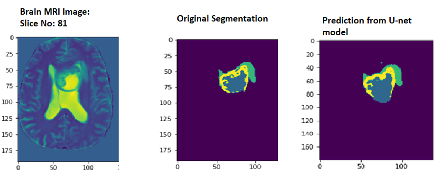

# Segmentation of Gliomas from brain MRI

Gliomas are Brain tumors that involve glial cells in the brain or spinal cord. Gliomas are classified as grades I to IV, where the grades indicate severity. 
The grades include 
 - grade I (benign, curable with complete surgical resection), 
 - grade II (low grade, undergo surgical resection, radiotherapy/chemotherapy, 
 - grade III/IV (high-grade glioma’s), and 
 - grade IV (glioblastoma). 
 
The task is to identify the location of the tumor, and its classification into three groups; 
- edema (indicates inflammation), 
- enhancing (indicates part of the tumor with active growth), and 
- the necrotic core (dead tissue, generally in the center). 
This task is important in practice, as the results are used for surgical planning. 

# Project Description

Each sample is a tensor of size = 4 x height (H) x width (W) x depth (D), where the four 3D tensors represent the 

     -  native (T1) and 
     -  post-contrast T1-weighted (T1Gd), 
     -  T2-weighted (T2), and 
     -  T2-FLAIR contrasts (images) of the brain MRI. 
 
Note that different samples may have slightly different dimensions H, W, and D -- your are models should be able to handle this. 
For training samples, you are also provided with a HxWxD label “image”, with a label for each voxel (3D pixel). Your task is to predict 
the segmentation of unlabelled images. This is also known as semantic segmentation in computer vision. Note that the output dimension for each sample is 
of size H x W x D.

# Learning Goals

    - Gain real-world experience with ML, subject to blind test evaluation
    - Investigate the effect of spatially correlated features. The use of convolution and other image processing techniques may be helpful.
    - Apply ML with high dimensional inputs and outputs
    - Grapple with data preprocessing/cleaning, if necessary

# Data

The train and validation split of the dataset are provided on box. You are provided with 204 labeled (training) samples and 68 unlabelled (validation) images,
all saved as NumPy tensors (.npy).

# References

1. https://github.com/as791/Multimodal-Brain-Tumor-Segmentation
2. https://github.com/woodywff/brats_2019
3. https://www.kaggle.com/andrewmvd/brain-tumor-segmentation-in-mri-brats-2015
